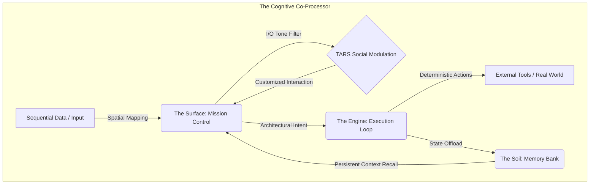
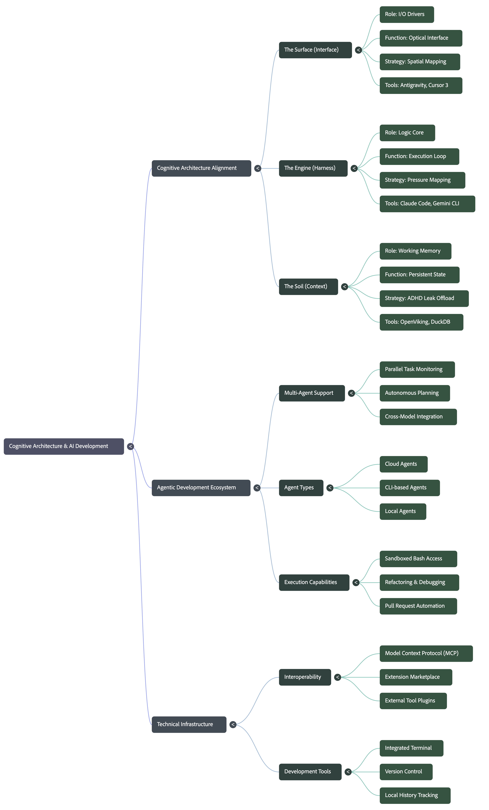

# The Cognitive Interface: A Co-Processor Architecture

  

## High-Level Overview
The Cognitive Interface is effectively a **CO-PROCESSOR** architecture designed to establish a functional framework for externalizing cognitive processes. The project creates a direct transition from internal cognitive functions—and their respective deficits, like "ADHD Leak"—into an externalized technological infrastructure. By spatializing sequential data, simulating patterns, and persisting state, the system minimizes Mental RAM overhead and optimizes "Cognitive IOPS".

## Documentation
For a detailed breakdown of the architecture, mechanisms, and functional alignment, see the [Cognitive Layered Stack Guide](./GUIDE.md).

## The Technology Stack

### 1. The Surface (Interface)
The Surface is your optical interface and the "mission control for parallel agent tasks".

*   **Concept:** Because sequential string processing (like reading syntax) is identified as a cognitive deficit, the Surface utilizes Spatial Mapping to convert text into "visual furniture". This bypasses linear syntax failures by providing a spatial anchor for monitoring agent states.
*   **TARS Social Modulation Module:** Isolated entirely within the Surface layer, this module acts as the ultimate I/O filter for tone, completely decoupled from the underlying processing engine. Inspired by the robot TARS, it allows you to dynamically toggle social friction settings—such as dropping Humor from 75% to 60% or setting Honesty to 95%—directly in your mission control.
*   **Tooling:** VSCode, Google Antigravity.

### 2. The Engine (Harness)
The Engine is the execution loop connecting the brain to the tools.

*   **Concept:** This layer acts as the operational arm of the Logic Core, translating high-level architecture, simulation, and pattern recognition into deterministic agent actions. It utilizes high-fidelity 3D Pressure Maps for historical and architectural analysis to bypass linear timeline limitations.
*   **Tooling:** Claude Code, Gemini CLI, Ollama.

### 3. The Soil (Context)
The Soil is the structured memory and local data analytics layer.

*   **Concept:** This layer serves as the hardware upgrade for a leaking Working Memory. Instead of your brain holding temporary sequential strings (like variable names or syntax), the Soil offloads this state management to high-performance local querying, ensuring that "ADHD Leak" does not disrupt the execution loop.
*   **Tooling:** OpenViking, DuckDB.

---

## Architecture Visualization

---

## Studio Concept Mindmap

---

Copyright © 2026 Voxel & The Positronic Filaments Project.  
Licensed under the Creative Commons Attribution-NonCommercial-ShareAlike 4.0 International License.
