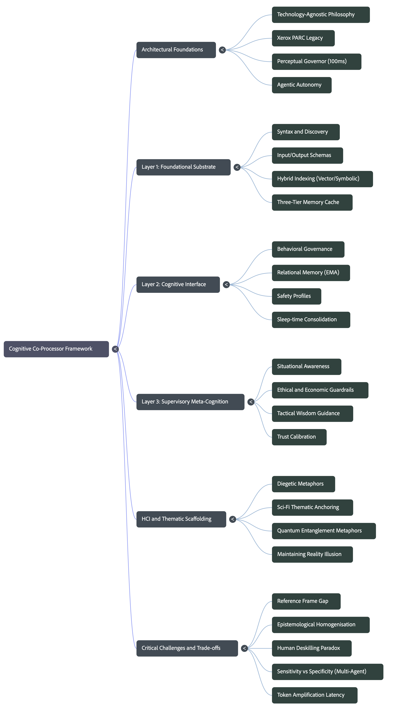

<!--
Metadata:
Document: The Cognitive Co-Processor Blueprint
Project: The Cognitive Co-Processor Framework
Focus: Tech-agnostic framework for Human-AI synergy, latency constants, and layered governance.
Key Concepts: Agentic Systems, Xerox PARC Legacy, Perceptual Governor, Hybrid Indexing, TRIAD Model, Diegetic Metaphors.
-->

# The Cognitive Co-Processor Blueprint: A Tech-Agnostic Framework for Human-AI Synergy

  

## 1. Introduction: The Evolution of the Digital Partner

We are navigating a profound architectural inflection point: the transition from "deterministic tools" to "agentic systems." For decades, software was a passive recipient of commands—brittle scripts that halted at the first sign of novelty. The emergence of agentic AI allows for systems that reason, plan, and autonomously perceive their environment. As a Lead Systems Architect, I view the "Cognitive Co-Processor" not as a mere application, but as a strategic extension of human intellect. By prioritizing tech-agnostic protocols over ephemeral software stacks, we ensure that the system functions as a resilient partner in reasoning, capable of extracting patterns via continuous feedback loops.

### Shift in Paradigm

| Traditional Software | The Cognitive Co-Processor |
| :--- | :--- |
| **Deterministic:** Follows rigid, predefined scripts. | **Agentic:** Goal-oriented; capable of planning and reasoning. |
| **Reactive:** Waits for granular user intervention. | **Proactive:** Operates with autonomous digital perception. |
| **Brittle:** Halts and throws errors when encountering novelty. | **Adaptive:** Extracts patterns via continuous learning loops. |
| **Tool-centric:** A separate entity used by a human. | **Synergistic:** A seamless extension of human capacity. |

Architecting for the human-perceptual constant requires us to honor the Xerox legacy, ensuring the bond between man and machine remains unbroken by the physics of latency.

---

## 2. The Golden Rule of Latency: The Xerox PARC Legacy

The conceptual blueprint for the Cognitive Co-Processor was established at Xerox PARC in the late 1980s. Researchers identified that for a digital agent to feel like a natural extension of thought, it must adhere to "perceptual constants"—specifically the 100-millisecond response threshold. To maintain the illusion of a seamless collaborative reality, our architecture employs a "Perceptual Governor."

**The Perceptual Governor:** Temporal synchrony is the non-negotiable foundation of HCI. In the architecture of human-AI collaboration, the system must prioritize a steady "10 frames-per-second" (100ms) refresh rate over high-resolution output. It is architecturally superior to sacrifice peripheral details—such as graphical fidelity, text labels, or highlighting—than to allow latency to exceed 100ms and shatter the user’s cognitive flow.

---

## 3. Layer 1: The Substrate (The Foundational Engine)

Layer 1 provides raw computational power, deterministic execution, and the "Core Syntax" of the system. It acts as a hardware-native logic engine rather than a passive document filter. To achieve this, Layer 1 manages three distinct caches:

1.  **Instruction Cache:** Directs immediate task execution.
2.  **Data Cache:** Manages transient information for active processes.
3.  **Knowledge Cache:** Dedicated to symbolic memory allocation and rule bases.

**Mandate: Hybrid Indexing & The Linear Separability Limit**  
Standard AI memory relies on fixed-dimensional embeddings (vector search), which are mathematically insufficient for representing complex Boolean logic due to the linear separability limit. Layer 1 must mandate Hybrid Indexing, combining dense vector search with symbolic data structures (predicate logic, semantic graphs) to ensure the system handles both intuitive associations and absolute logical truths.

---

## 4. Layer 2: The Interface (The Behavioral Governor)

Layer 2 serves as the "Cognitive Bridge." It is the exclusive domain of interaction dynamics, relational memory, and execution safety. Its strategic role is to ensure the AI behaves as a trusted partner rather than a black-box oracle.

### Relational Memory & Narrative Consolidation
To prevent context window collapse from informational noise, Layer 2 employs a dedicated **Sleep-time Agent**. This background process distills massive interaction histories into compressed narrative layers, mimicking human memory consolidation. Relational alignment is maintained via Exponential Moving Average (EMA) filtering, which prioritizes recent contextual shifts while ensuring long-term user patterns (formality, analytical depth) are preserved.

### Execution Safety Profiles
Layer 2 enforces safety by mapping every proposed action to a specific protocol-level profile:

| Profile | Description |
| :--- | :--- |
| **Readonly** | Purely informational; no state changes. |
| **Idempotent** | Safe to retry; no unintended side effects if connection drops. |
| **Requires_Approval** | Demands explicit human verification before execution. |
| **Destructive** | Permanent actions; overwriting or deleting system data. |

---

## 5. Layer 3: The Supervisory (Tactical Wisdom & Ethics)

Layer 3 acts as "System 3," the meta-cognitive layer providing long-term strategic coherence. It monitors "Token Amplification"—the explosion of hidden reasoning tokens that threaten the 100ms latency budget—and enforces ethical guardrails.

### The TRIAD Model of Governance
The TRIAD model maps across our architecture to ensure industry-standard deployment:

*   **Trust Calibration & Outcome Governance (Layer 3):** Holistic evaluation of system-level outcomes and ethical constraints.
*   **Interface & Safeguards (Layer 2):** Deployment of workflow-native interfaces and behavioral safety.
*   **Technical Grounding & Normative Validation (Layer 1):** Empirical testing of raw computational efficiency and schema alignment.

### Multi-Agent Consensus: Sensitivity vs. Specificity
Layer 3 must balance the "LLM Council" trade-off. While multi-agent ensembles increase accuracy (Sensitivity), they often overwhelm the user with false positives (Specificity).

| Framework Implementation | Sensitivity | Specificity | Operational Finding |
| :--- | :--- | :--- | :--- |
| Single LLM | 0.85 | 0.97 | High specificity; misses edge cases. |
| Multi-Agent (OR Rule) | High | Low | Maximizes coverage; overwhelms user. |
| 3-Layer Screen | 0.81 - 0.88 | 0.86 - 1.00 | Optimal balance for human-in-the-loop. |

---

## 6. The Sci-Fi Scaffold: Why "Positronic Filaments" Matter

Utilizing science-fiction themes is a functional diegetic metaphor that provides cognitive scaffolding for "alien" logic.

*   **Quantum Entanglement Metaphor:** By framing the interface around the transition $|\psi\rangle \to |n\rangle$, we prime the user to accept the AI as a direct extension of the self. This frames the AI as participating in the same objective reduction process as the human brain, allowing users to intuitively "comprehend" 12-dimensional matrices and abstract data structures.
*   **Magneto-electric Androids (Hadaly):** Establishes "anthropomorphic anchoring," signaling that the entity is an "other" with extraordinary capabilities but specific, non-human boundaries.
*   **Positronic Filaments:** Provides a familiar narrative framework for non-linear, hyper-dimensional processing, reducing the friction of absorbing machine logic.

---

## 7. Critical Risks: Avoiding "The Reference Frame Gap"

The most insidious risk is epistemological homogenization—the tendency of AI to force "average" consensus thoughts onto the user. This creates a **Reference Frame Gap** where the system’s reliance on historical data stifles revolutionary thinking.

**The Deskilling Paradox:** As the co-processor handles logic and error correction, the user’s foundational skills may atrophy. This leads to an operational crisis: the human is expected to audit the AI but no longer possesses the expertise to do so.

> [!WARNING]
> **Warning: Intellectual Mediocrity**  
> To bridge the Reference Frame Gap, users must remain active participants. The framework mandates Transparent Logic Traces and Phase 6 Continuous Collaboration, where human expertise directly shapes symbolic knowledge bases.

---

## 8. Implementation Mandates & Conclusion

The true value of this architecture lies in its universal protocols, not specific AI models. We must prioritize structural rules over ephemeral trends.

### Architectural Synthesis

| Layer | Responsibility | Primary Metric |
| :--- | :--- | :--- |
| **1: Substrate** | Syntax & Discovery | Precision (Schema Alignment) |
| **2: Interface** | Governance & Behavior | Synchrony (100ms Latency) |
| **3: Supervisory** | Tactical Wisdom | Ethics (Trust & Outcome) |

### Implementation Checklist
- [ ] Implement Hybrid Indexing to overcome the linear separability limit of embeddings.
- [ ] Deploy Sleep-time Agents to distill signal history into narrative layers.
- [ ] Enforce 10 FPS minimums via the Perceptual Governor to maintain cognitive flow.
- [ ] Integrate Reference Frame Compatibility Assessments in Layer 3.
- [ ] Monitor Token Amplification (hidden reasoning tokens) for temporal viability.
- [ ] Utilize Diegetic Metaphors (e.g., Hadaly-style Android motifs) to establish clear HCI anchors.

---

## Framework Visualization

   
  <em>The Cognitive Co-Processor Mind Map</em>

   
  <em>The Cognitive Co-Processor Info Graph</em>

---

Copyright © 2026 Voxel & The Positronic Filaments Project.  
Licensed under the Creative Commons Attribution-NonCommercial-ShareAlike 4.0 International License.
